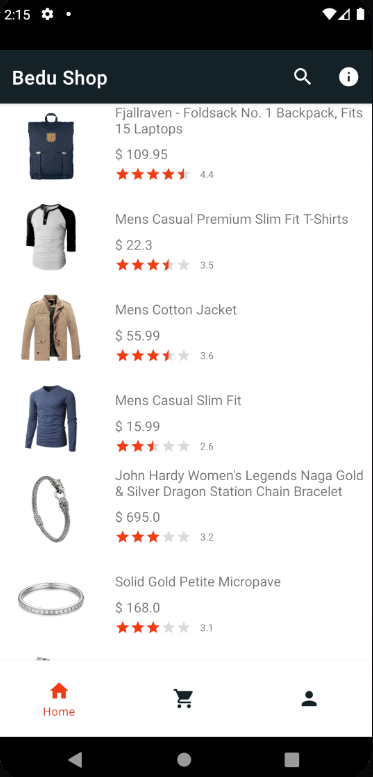

# Lista de productos📋

La lista de productos, consiste en un RecyclerView dentro de un fragmento.
Durante la cursada, la carga de los productos se realizó de 3 maneras distintas a medida que los temas iban evolucionando:
- En primer lugar los obtuvimos a través de un JSON almacenado dentro de nuestros repositorios, convirtiéndolo en un JSONObject y finalmente obteneniendo una lista de productos utilizando GSON.
- En segundo lugar se obtuvo la información mediante una API albergada en [fakestoreAPI](https://fakestoreapi.com/products).
Para realizar esto se utilizó la herramienta OkHttp enviando una solicitud de manera asíncrona y luego se formateo el JSON obtenido usando GSON con la clase Product. 
Como la clase Product define un rating bar de tipo flotante mientras que el JSON obtenido define al rating como un objeto con dos valores, en los cuáles uno de ellos es el que nos interesa; para armar el objeto Product, se tuvo que generar un “deserializador” (ProductJsonDescerializer) y pasarlo como adaptador a GSON para que generara el producto con el formato necesario.
- Finalmente se optó por guardar los productos en una base de datos no relacional manejada con  Realm y obteniendolos mediante una consulta:

```java
    val realm= Realm.getDefaultInstance()
    val productos= realm.where(Product::class.java).findAll()
```

Cada ítem de la lista tiene asignado un listener que al seleccionarse, guarda el producto al que hace referencia y lo manda, utilizando safeArgs, al fragmento de detalle del producto.

```java
 listener={ product: Product, imageView: ImageView ->
            val action= ProductListFragmentDirections.actionProductListFragment2ToProductDetailFragment2(product)
            
            val extras= FragmentNavigatorExtras(
                imageView to "product_transition"
            )

            findNavController().navigate(action, extras)
        }
```

