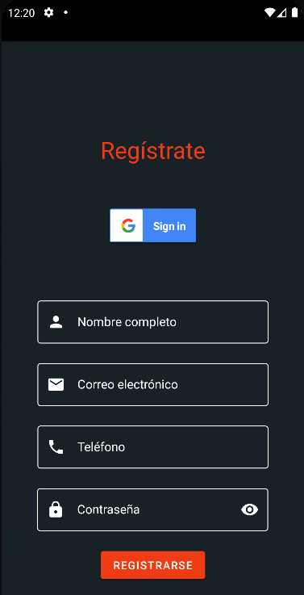

# Registro y Login

El registro consiste en un fragmento que solicita datos.
Para que este sea exitoso el usuario debe llenar todos los campos. 
El campo "email" corrobora que la cadena ingresada tenga el formato de correo electónico contrastándola utilizando Regex.
Los mensajes de error se muestran en color rojo usando un smalltext debajo del campo. 

 

El logín consiste de dos campos, email y contraseña, y un botón de inicio de sesión.
Para que el acceso sea satisfactorio, ambos campos deben estar completos y el mail debe estar en formato correcto, si alguna de estas condiciones no se cumple la interfaz te avisará con un mensaje y un gráfico de error. 
Por el momento los usuarios permitidos son los siguientes (acompañados de cualquier contraseña) :

* george.bluth@reqres.in
* janet.weaver@reqres.in
* emma.wong@reqres.in
* eve.holt@reqres.in
* charles.morris@reqres.in
* tracey.ramos@reqres.in
* michael.lawson@reqres.in
* lindsay.ferguson@reqres.in
* tobias.funke@reqres.in
* byron.fields@reqres.in
* george.edwards@reqres.in
* rachel.howell@reqres.in

En el backend el proceso de login verifica, mediante un POST a una API llamada [REQ|RES](https://reqres.in/api/login) utilizando OkHttp, si la respuesta que recibe es un token, de ser así permite el acceso y en caso contrario emite un mensaje utilizando un Snackbar. 