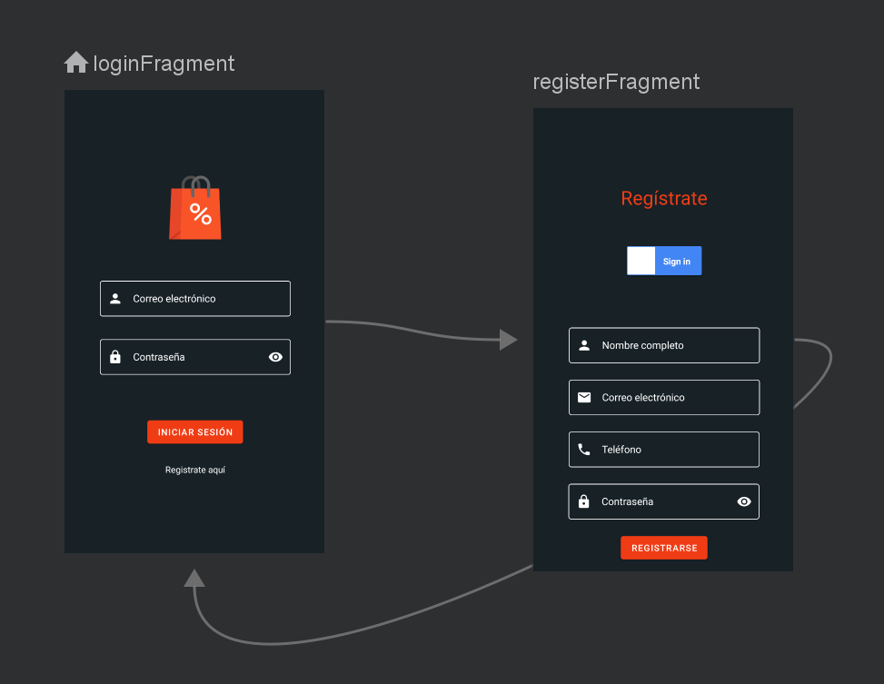
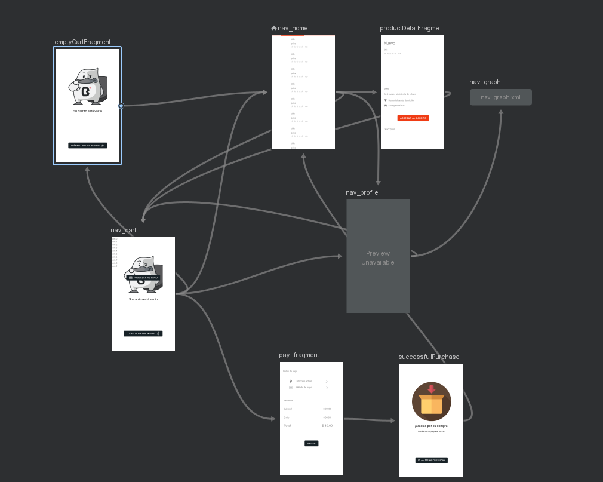

# Navegación 🚀

Para la navegación entre fragmentos se utiliza la herramienta Navigation que viene con Android Jetpack.
Debido a que el proyecto consta de dos activities, una para el proceso de login y otra para el transcurso de la aplicación finalizada la primera, se definieron dos gráficos de navegación dentro del recurso navigation:

- **nav_graph** para el main activity  

- **nav_logged_graph** para la logged activity  

