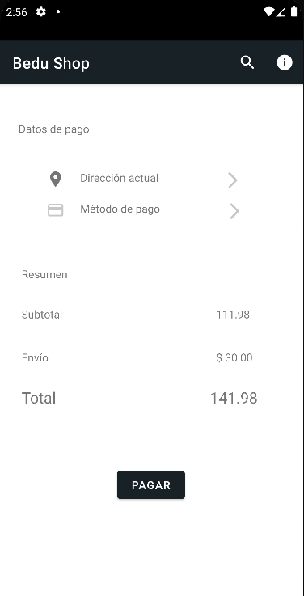
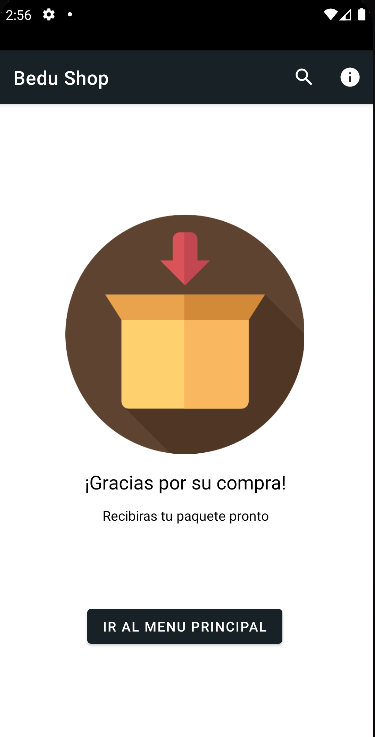
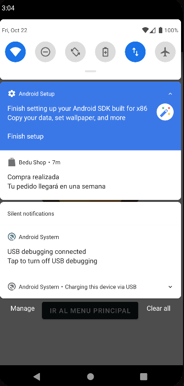

# Pago

Este fragmento posee un mockup de opciones.

El subtotal se obtiene por safeArgs desde el fragmento carrito, que toma todos los elementos del mismo y los multiplica por su cantidad.

Luego el total es calculado sumándole 30 al subtotal.

El presionar el boton "pagar" nos lleva a otro fragmento que da un mensaje de confirmación

Junto con esta pantalla aparece también una notificación informando que la compra se ha concretado de forma exitosa y al hacerle clic ingresamos a la pantalla de pago exitoso en la aplicación

