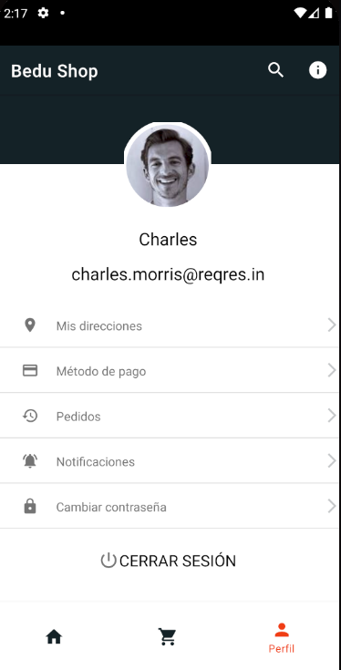
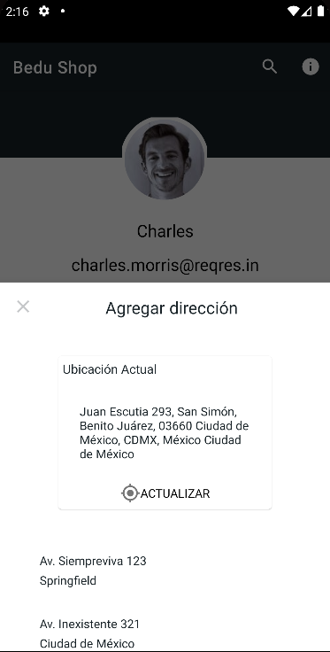

# Perfil de usuario

El perfil del usuario muestra la imágen de perfil, datos de login y un listado de elementos seleccionables, de los cuáles sólo la ubicación tiene funcionalidad implementada.

Al presionar la opción “Mis Direcciones”, se desplegará un fragmento emergente que mostrará direcciones entre las cuales se destaca la dirección actual. 
Cuando hacemos clic sobre el botón actualizar, el dispositivo pedirá acceso al hardware para activar el GPS y refrescará la dirección actual.

Al final del listado del perfil, tenemos una opción para cerrar sesión que nos llevará de nuevo al inicio de la aplicación. 
